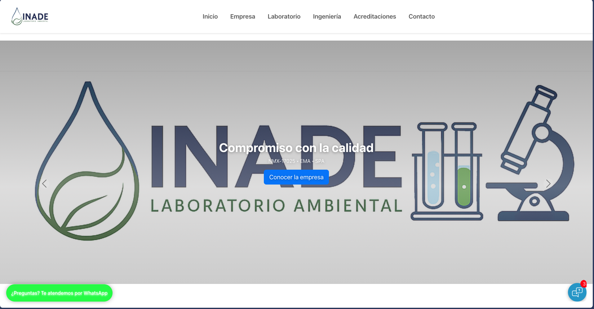
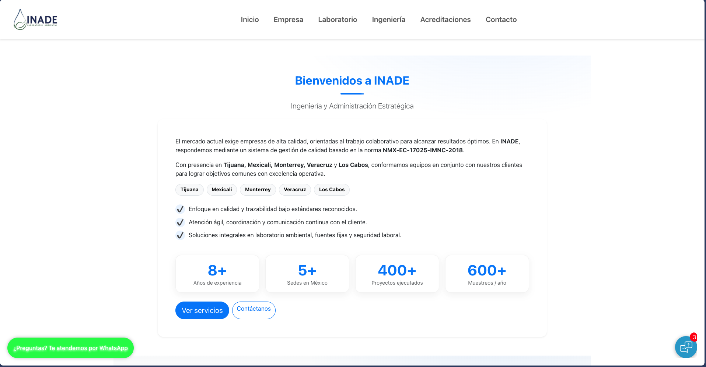
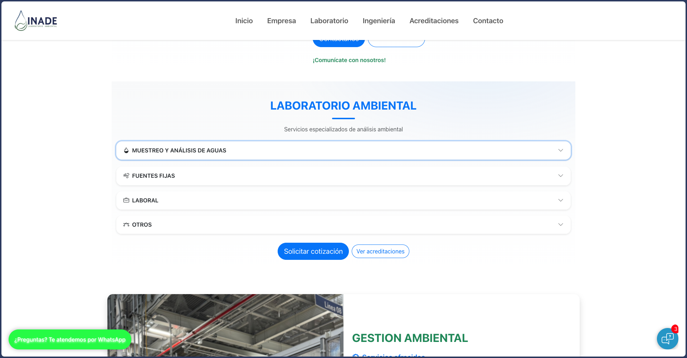
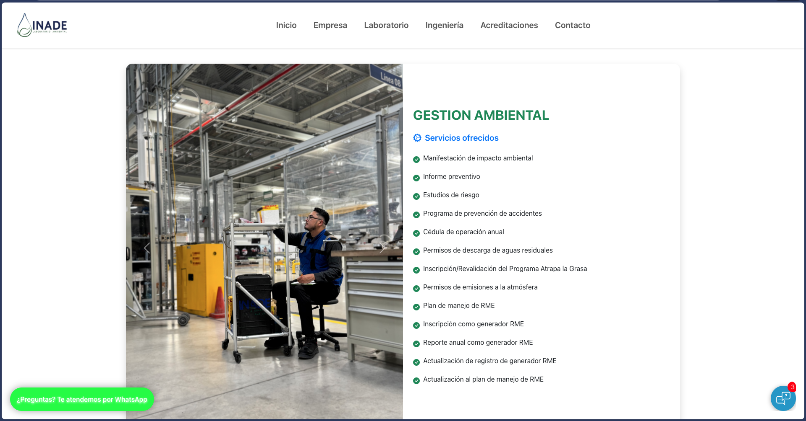
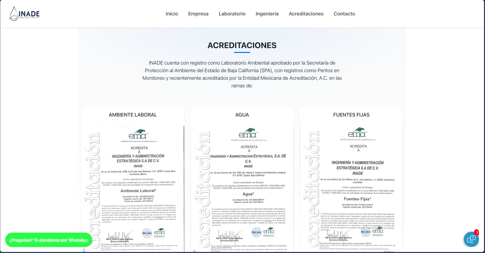

# 🌐 Rediseño total del sitio web de INADE

Este proyecto consiste en el **rediseño completo de la página oficial de [INADE](https://inade.mx/)**, con un enfoque en **modernizar la interfaz**, **mejorar la experiencia del usuario** y **optimizar el rendimiento general** del sitio.

---

## ✨ Vista general del resultado

A continuación se muestran algunas capturas del diseño final implementado:

### 🏠 Página principal


### 🙌 Sección de bienvenida


### 🔬 Sección de laboratorio


### 🌱 Sección ambiental


### 🧾 Acreditaciones


---

## 🛠️ Tecnologías utilizadas

- **React.js** – Framework principal del front-end  
- **Bootstrap 5** – Componentes de interfaz modernos y responsivos  
- **HTML5 / CSS3 / JavaScript (ES6+)**  
- **Git & GitHub** – Control de versiones y despliegue  
- **Suempresa** – Hosting y despliegue del sitio en producción  

---

## 🚀 Ejecución local

Si deseas ejecutar el proyecto en tu entorno local:

```bash
# Clonar el repositorio
git clone https://github.com/AdrianITT/Frontendwix.git

# Entrar al directorio
cd Frontendwix

# Instalar dependencias
npm install

# Ejecutar en modo desarrollo
npm start
